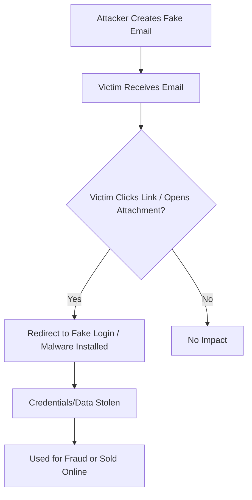

# Analyze a Phishing Email Sample

### What is Phishing?
Phishing is a cyberattack where someone pretends to be a trusted person or organization (like a bank, company, or friend) to trick you into giving away sensitive information or taking harmful actions.
It usually happens through emails, but can also occur via SMS (smishing), calls (vishing), or even fake websites.

# Email Phishing – How It Works

**Email phishing** is a type of cyberattack where attackers trick people into revealing sensitive information (like passwords, bank details, or personal data) or performing actions (like clicking malicious links or downloading malware) by sending fake but convincing emails.

---

## How Email Phishing Happens

1. **Preparation** –  
   Attackers create a fake email address or use a compromised account, often mimicking legitimate organizations (e.g., `micros0ft-support.com`).

2. **Baiting the Victim** –  
   They send emails with urgent or tempting messages, such as:  
   - "Your account will be suspended! Click here to verify."  
   - "You’ve won a prize! Claim it now."  

   These emails usually contain:
   - **Malicious links** → Fake login pages to steal credentials.  
   - **Infected attachments** → Install malware or ransomware.  

3. **Exploitation** –  
   Victims click the link or open the attachment.  
   - **Fake login pages** collect usernames & passwords.  
   - **Malicious files** infect the system.  

4. **Harvesting** –  
   Attackers use stolen information for:  
   - Identity theft  
   - Financial fraud  
   - Selling data on the dark web  

---

## How to Spot Phishing Emails

- Suspicious **sender address** (e.g., `support@paypa1.com`).  
- **Urgent or threatening language** ("Act now or your account will be locked!").  
- **Generic greetings** ("Dear Customer").  
- **Mismatched URLs** (hovering shows a different link).  
- **Unexpected attachments** or requests for personal info.  

---

## Example Scenario

> You get an email from "Bank Support" saying:  
> *"We noticed unusual activity. Log in now to secure your account."*  
>  
> You click the link → It opens a fake login page → You enter credentials → **Attacker now has access to your account.**

---

## Visual Flow (Phishing Attack)

## How to Spot Phishing Emails
- Check **sender address** (fake domains like `support@paypa1.com`).  
- Watch for **urgent or threatening language**.  
- Avoid clicking **unexpected links or attachments**.  
- Use **multi-factor authentication (MFA)**.  

---

## Full Step-by-Step Process with Screenshots
We’ve created a detailed PDF guide showing:  
- **How to view full email headers**  
- **How to analyze phishing emails using tools (e.g., MXToolbox)**  
- **Step-by-step screenshots** for better understanding  

**[Download the PDF Guide](./Phishing_Analysis_Guide.pdf)** 

## Conclusion

Email phishing remains one of the most common and dangerous cyber threats.  
By understanding **how phishing works**, recognizing **warning signs**, and following **safe practices**, individuals and organizations can significantly reduce their risk.  
Always verify suspicious emails, avoid clicking unknown links or attachments, and use **multi-factor authentication** wherever possible.  
