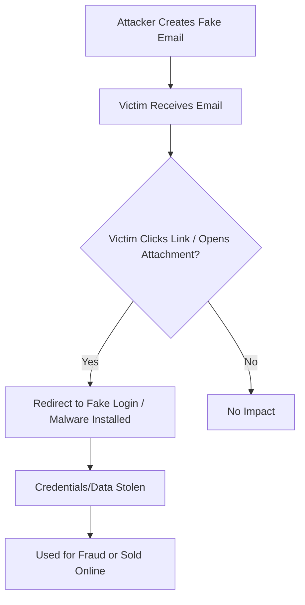

# Analyzing a Sample Phishing Email

## Table of Contents
- [Email Phishing – How It Works](#email-phishing--how-it-works)
- [How Email Phishing Happens](#how-email-phishing-happens)
- [Example Scenario](#example-scenario)
- [Visual Flow (Phishing Attack)](#visual-flow-phishing-attack)
- [How to Spot Phishing Emails](#how-to-spot-phishing-emails)
- [Examples of Phishing Emails](#example-of-a-phishing-email)
- [Full Step-by-Step Process](#full-step-by-step-process-with-screenshots)
- [Types of Phishing](#types-of-phishing)
- [Additional Resources & Tools](#additional-resources--tools)
- [Conclusion](#conclusion)

---

## What is Phishing?
Phishing is a cyberattack where someone pretends to be a trusted person or organization (like a bank, company, or friend) to trick you into giving away sensitive information or taking harmful actions.
It usually happens through emails, but can also occur via SMS (smishing), calls (vishing), or even fake websites.

## Email Phishing – How It Works

**Email phishing** is a type of cyberattack where attackers trick people into revealing sensitive information (like passwords, bank details, or personal data) or performing actions (like clicking malicious links or downloading malware) by sending fake but convincing emails.

---

### How Email Phishing Happens

1. **Preparation** –  
   Attackers create a fake email address or use a compromised account, often mimicking legitimate organizations (e.g., `micros0ft-support.com`).

2. **Baiting the Victim** –  
   They send emails with urgent or tempting messages, such as:  
   - "Your account will be suspended! Click here to verify."  
   - "You’ve won a prize! Claim it now."  

   These emails usually contain:
   - **Malicious links** → Fake login pages to steal credentials.  
   - **Infected attachments** → Install malware or ransomware.  

3. **Exploitation** –  
   Victims click the link or open the attachment.  
   - **Fake login pages** collect usernames & passwords.  
   - **Malicious files** infect the system.  

4. **Harvesting** –  
   Attackers use stolen information for:  
   - Identity theft  
   - Financial fraud  
   - Selling data on the dark web  

---

## Example Scenario

> You get an email from "Bank Support" saying:  
> *"We noticed unusual activity. Log in now to secure your account."*  
>  
> You click the link → It opens a fake login page → You enter credentials → **Attacker now has access to your account.**

---

## Visual Flow (Phishing Attack)

## How to Spot Phishing Emails
- Check **sender address** (fake domains like `support@paypa1.com`).  
- Watch for **urgent or threatening language**.  
- Avoid clicking **unexpected links or attachments**.  
- Use **multi-factor authentication (MFA)**.  

### Example of a Phishing Email  
Below are examples of how phishing emails often appear:

**[Spam Email Example 1](./spam1.png)**  
*Example 1: Fake "Account Verification" email designed to steal credentials.*

**[Spam Email Example 2](./spam2.png)**  
*Example 2: Urgent "Order Conformation" email tricking the user into opening a malicious file.*

## Full Step-by-Step Process with Screenshots
We’ve created a detailed PDF guide showing:  
- **How to view full email headers**  
- **How to analyze phishing emails using tools (e.g., MXToolbox)**  
- **Step-by-step screenshots** for better understanding  

**[Download the PDF Guide](./Phishing_Analysis_Guide.pdf)** 

## Types of Phishing

| **Type**                   | **Description**                                               | **Example** |
|----------------------------|---------------------------------------------------------------|-------------|
| **Email Phishing**         | Mass emails sent to trick users into clicking links or sharing information. | "Verify your account or it will be suspended!" |
| **Spear Phishing**         | Targeted emails personalized for specific individuals or organizations. | Email addressed to you with your name & job details asking for login info. |
| **Whaling**                | Phishing aimed at high-level executives or decision-makers.   | Fake legal notice sent to a CEO requesting urgent payment. |
| **Clone Phishing**         | A legitimate past email is duplicated, but links/attachments are replaced with malicious ones. | Resent company newsletter with infected attachment. |
| **Vishing**                | Voice phishing via phone calls pretending to be banks, tech support, or government officials. | Call claiming "Your bank account is locked, share your OTP to unlock." |
| **Smishing**               | Phishing via SMS messages containing malicious links or requests. | "Click this link to claim your package delivery." |
| **Business Email Compromise (BEC)** | Impersonating executives or vendors to request wire transfers or sensitive data. | Fake email from CFO requesting urgent funds transfer. |
| **Pharming**               | Redirecting users to fake websites by manipulating DNS or malware. | Typing `yourbank.com` but being redirected to a fake login page. |
| **Angler Phishing**        | Social media-based phishing, using fake accounts or links.    | Fake "customer support" account asking for your login credentials. |

---

## Additional Resources & Tools
- [MXToolbox](https://mxtoolbox.com/EmailHeaders.aspx) – Analyze email headers.
- [Google Toolbox](https://toolbox.googleapps.com/apps/messageheader/) – View routing information of suspicious emails.
- [Microsoft Header Analyzer](https://mha.azurewebsites.net/) – Analyze email headers (for Outlook/Office 365).

## Conclusion

Email phishing remains one of the most common and dangerous cyber threats.  
By understanding **how phishing works**, recognizing **warning signs**, and following **safe practices**, individuals and organizations can significantly reduce their risk.  
Always verify suspicious emails, avoid clicking unknown links or attachments, and use **multi-factor authentication** wherever possible.  
